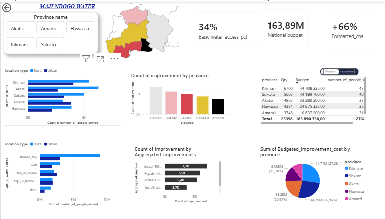
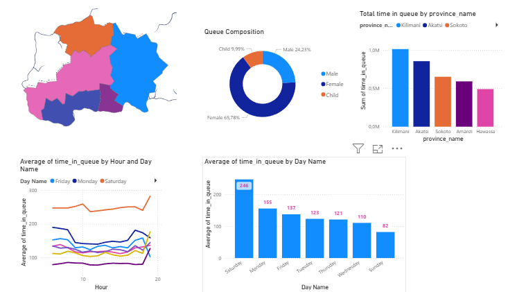
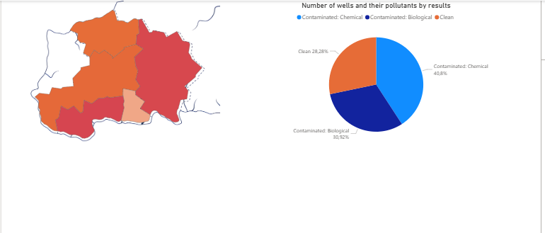
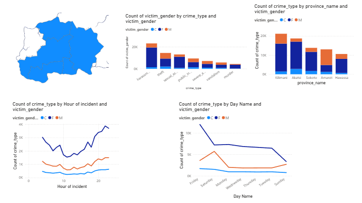
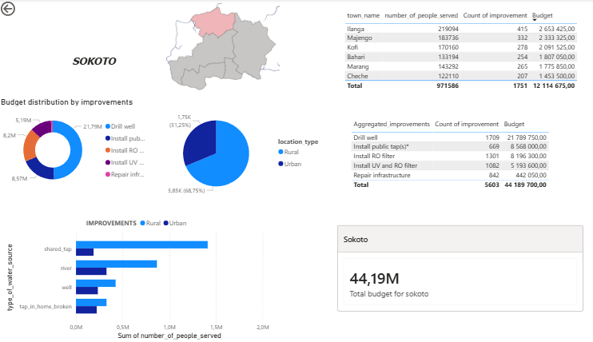
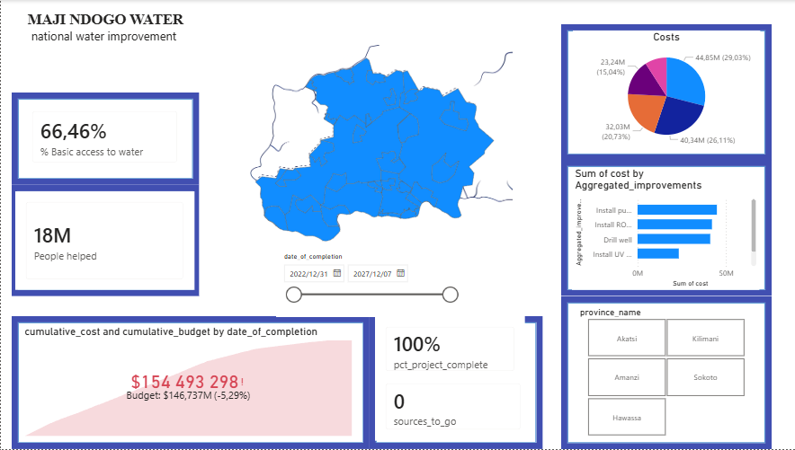

# 💧 Maji Ndogo: Visualizing the Currents of Change

> A data visualization and reporting project built in Power BI to analyze and communicate the water access crisis in the fictional nation of Maji Ndogo: part of the ALX/ExploreAI Data Analytics programme.

---

## 📌 Project Overview

Maji Ndogo is a multi-part data analytics project that follows a team of analysts tasked with transforming raw survey data into actionable insights for national and provincial decision-makers. The project spans data exploration, visual analysis, data modelling, and the creation of a polished interactive Power BI report.

The ultimate goal is to help President Aziza Naledi and provincial leaders understand:
- The state of water access across Maji Ndogo's ~28 million people
- How many people are affected and where
- What infrastructure improvements are needed
- How much the upgrades will cost: and track progress once underway

---

## 📊 Final Dashboard Preview


*National report page showing population breakdown, improvement counts, and budget summary*

---

## 📂 Project Structure

The project is divided into **four parts**, each building on the previous:

### Part 1: Visualising Maji Ndogo's Past
- Imported survey data (`Md_summary.csv`) into Power BI
- Explored national water source statistics using pie charts and bar charts
- Built a **custom shape map** of Maji Ndogo's provinces using `MD_Provinces.json`
- Visualized broken infrastructure by province
- Analyzed **queue times** by day of week and hour of day
- Examined **gender composition** of water collection queues
- Introduced crime data (`Md_queue_related_crime.csv`) linked to water source locations

**Key Insights:**
- 63.85% of the population lives in rural areas
- 43% of people rely on shared taps, often with 2,000+ people per tap
- Average queue time exceeds 120 minutes nationally
- Saturday queues are significantly longer than any other day (avg 246 min)
- Women make up 66% of water collectors throughout the week

---

### Part 2: Moulding Data into Visual Stories
- Upgraded from a single table to a **multi-table data model** using `Md_water_services_data.xlsx`
- Built and cleaned a **multi-star schema** in Power BI's model view
- Fixed table relationships (`location` headers, `queue_composition`, `water_source_related_crime`)
- Extracted `day_name` and `hour_of_day` columns from timestamps using Power Query
- Rebuilt all visuals using proper relational data across four report pages

**Queue Analysis:**


*Queue times by day and hour, gender composition donut chart, and total time queued per province*

**Well Pollution Map:**


*Province-level pollution map showing only 28.28% of wells are clean nationally*

**Crime Data:**


*Gender disparity in water-related crimes by type, province, hour, and day of week*

**Key Insights:**
- Women are twice as likely to be crime victims near water sources
- Harassment and sexual assault are the most common crimes against women
- Crime spikes on weekends and late at night/early morning
- Kilimani has the highest total crime count; Amanzi the lowest for women

---

### Part 3: Communicating Our Findings
- Designed reports using a **user story framework** for two audiences:
  - **President Aziza Naledi**: national overview, budget, and projected impact
  - **Provincial Leaders**: localized breakdown per province with drill-through
- Created DAX calculated columns and measures for budget, basic water access classification, and projected improvement
- Built bookmark toggles for switching between Province and Improvements budget views
- Added drill-through from the national page to each provincial report

**Provincial Report Example: Sokoto:**


*Sokoto provincial page showing town-level budget breakdown, improvement types, and rural/urban split*

**National Summary:**

| Metric | Value |
|---|---|
| Total Population | ~27.6 Million |
| Current Basic Water Access | 34% |
| Total Upgrade Budget | ~$163.89 Million |
| Projected Improvement | +66% |
| Total Improvements Required | 25,398 |

---

### Part 4: Project Progress Tracking
- Built a **live project tracking dashboard** to monitor implementation progress
- Tracks actual costs vs budgeted costs over time using a date range slider
- Monitors vendor performance and completed projects per contractor
- Shows real-time `sources_to_go` countdown and `pct_project_complete`
- Actual spend came in at **$154.49M** vs a budget of **$146.74M** (5.29% over budget)


*Project completion dashboard: 100% complete, 18M people helped, 66.46% basic water access achieved*

---

## 🗋 Data Preparation

Data cleaning and exploration was performed using MySQL Workbench prior to visualization. This included exploring the `mdd_water_services` database, filtering duplicate visit records, checking water quality results, and validating pollution data. The cleaned dataset was then provided as input to Power BI.

---

## 🗃️ Data Sources

| File | Description |
|---|---|
| `Md_summary.csv` | Consolidated single-table survey summary with gender queue composition |
| `Md_water_services_data.xlsx` | Multi-table workbook: visits, location, water_source, well_pollution, queue_composition, project_progress, infrastructure_cost, water_source_related_crime |
| `Md_queue_related_crime.csv` | Crime records linked to water source locations over 10 years |
| `MD_Provinces.json` | Custom GeoJSON map of Maji Ndogo's provinces |
| `MD_Map.png` | Background map image for the shape map visual |

---

## 🛠️ Tools & Technologies

- **Power BI Desktop**: data modelling, DAX, and report building
- **Power Query**: data transformation and column extraction
- **DAX**: calculated columns, measures, and conditional logic
- **Excel**: multi-table data source
- **CSV**: flat file data sources
- **GeoJSON**: custom map shape file

---

## 📐 Report Pages

| Page | Description |
|---|---|
| National | High-level overview for President Naledi: population, improvements, budget |
| Queues | Queue time analysis by hour, day, province, and gender |
| Pollution | Well pollution map and contamination breakdown |
| Crime | Water-related crime analysis by gender, type, time, and province |
| Sokoto | Provincial drillthrough report |
| Akatsi | Provincial drillthrough report |
| Amanzi | Provincial drillthrough report |
| Hawassa | Provincial drillthrough report |
| Kilimani | Provincial drillthrough report |
| Progress Tracking | Live project implementation dashboard |

---

## 📐 DAX Highlights

```dax
-- Classify water source as Basic or Below Basic Access
Basic_water_access =
IF(
    AND(water_source[type_of_water_source] = "well",
        RELATED(well_pollution[results]) = "Clean"),
    "Basic Access",
    IF(water_source[type_of_water_source] = "tap_in_home",
        "Basic Access",
        IF(AND(water_source[type_of_water_source] = "shared_tap",
               water_source[Average_queue_time] < 30),
            "Basic Access",
            "Below Basic Access"
        )
    )
)

-- Rural-adjusted improvement cost (50% premium for rural sources)
Rural_adjusted_cost =
    infrastructure_cost[unit_cost_USD] * 1.5

-- Aggregate tap improvement categories
Aggregated_improvements =
IF(
    CONTAINSSTRING('project_progress'[improvement], "tap"),
    "Install public tap(s)*",
    IF('project_progress'[improvement] == "Diagnose local infrastructure",
        "Repair infrastructure",
        'project_progress'[improvement]
    )
)

-- Format projected improvement as a signed percentage
Formatted_change =
VAR ChangePct = [Access_once_complete] * 100
RETURN
IF(ChangePct > 0,
    "+" & FORMAT(ChangePct, "0") & "%",
    FORMAT(ChangePct, "0") & "%"
)
```

---

## 🌍 Key Findings

1. **Rural majority**: 64% of Maji Ndogo's ~28 million people live in rural areas with limited water infrastructure
2. **Shared tap dependency**: 43% of the population relies on shared taps, often serving 2,000+ people per tap
3. **Long queues**: average queue times exceed 120 minutes; Saturdays average 246 minutes
4. **Well contamination**: only 28% of wells are clean nationally
5. **Broken infrastructure**: 45% of home tap infrastructure is non-functional
6. **Gender inequality**: women account for 66% of water collectors and face disproportionate safety risks
7. **Crime correlation**: crimes near water sources spike on weekends and at night, primarily targeting women
8. **Project outcome**: all 25,398 improvements completed, raising basic water access from 34% to 66.46%, helping 18 million people

---

## 💰 Provincial Budget Summary

| Province | Population | Improvements | Budget |
|---|---|---|---|
| Kilimani | 6,584,764 | 6,700 | $44,708,325 |
| Sokoto | 5,774,434 | 5,603 | $44,189,700 |
| Akatsi | 5,993,306 | 4,963 | $33,280,200 |
| Hawassa | 3,843,810 | 4,384 | $24,875,325 |
| Amanzi | 5,431,826 | 3,748 | $16,837,200 |
| **Total** | **27,628,140** | **25,398** | **$163,890,750** |

---

## 🚀 Getting Started

1. Clone or download this repository
2. Open Power BI Desktop
3. Load `Md_water_services_data.xlsx` as the primary data source
4. Import `MD_Provinces.json` for the custom shape map visual
5. Place `MD_Map.png` as a background image behind the map visual
6. Apply all DAX columns and measures as documented above

---

## 🏫 About This Project

This project was completed as part of the **ALX / ExploreAI Academy Data Analytics programme**. It is a fictional case study designed to develop real-world skills in data cleaning, SQL, data modelling, DAX, and Power BI reporting.

---

## 📄 License

This project is for educational purposes. Data and storyline are fictional and created by ExploreAI © 2023.
